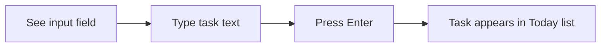
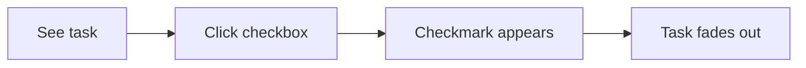
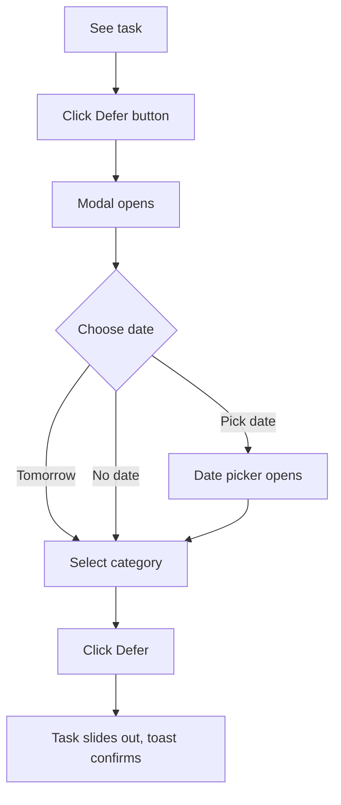

# Today UX Design Specification

_Created on 2026-01-05 by Vishal_
_Generated using BMad Method - Create UX Design Workflow v1.0_

---

## Executive Summary

**Today** is a minimalist to-do app built on a simple philosophy: *you can only do what you can do today*.

**Target Users:** People overwhelmed by traditional to-do apps who want focus and calm - not another inbox of guilt, but a tool that reduces cognitive load.

**Core Value Proposition:** Today-first visibility with intentional deferment. The main screen shows only today's tasks. Everything else is consciously pushed to tomorrow, a future date, or a categorized "someday" bucket.

**Platform:** Web application (SPA), fully responsive across desktop, tablet, and mobile.

**Visual Direction:** Slate Sophisticated "minimal paper" aesthetic - clean, calming, paper-like surfaces that let tasks breathe.

---

## 1. Design System Foundation

### 1.1 Design System Choice

**Decision:** Custom design system based on Slate Sophisticated theme

**Rationale:** The user has an established visual language from Discovery mockups that defines a specific "minimal paper" aesthetic. Rather than fight against a pre-built design system, we'll use:

- **Tailwind CSS** for utility-first styling
- **Custom components** built to match the Slate Sophisticated design tokens
- **Radix UI primitives** (unstyled) for accessible modal, dropdown, and date picker behaviors

**Why not shadcn/ui or other systems:**
- The visual identity is already defined and specific
- Minimal component needs (this is a simple app)
- Full control over the paper-like aesthetic

**Component Library Strategy:**
| Component | Approach |
|-----------|----------|
| Buttons | Custom (simple, minimal) |
| Task Card | Custom |
| Tabs | Custom (discreet styling) |
| Modal | Radix Dialog + custom styling |
| Date Picker | Radix Popover + custom calendar |
| Dropdown | Radix Select + custom styling |
| Text Input | Custom |

### 1.2 Design Tokens

**Colors (Slate Sophisticated):**
```css
:root {
  /* Backgrounds */
  --background: #f8fafc;
  --surface: #ffffff;
  --surface-muted: #f1f5f9;

  /* Borders */
  --border: #e2e8f0;
  --border-subtle: #f1f5f9;

  /* Text */
  --foreground: #0f172a;
  --muted-foreground: #64748b;
  --tertiary: #94a3b8;

  /* Accents */
  --primary: #475569;
  --primary-hover: #334155;
  --accent: #0f172a;

  /* Semantic */
  --success: #22c55e;
  --success-bg: #f0fdf4;
  --error: #ef4444;
  --error-bg: #fef2f2;
}
```

**Typography:**
```css
:root {
  --font-display: 'Playfair Display', Georgia, serif;
  --font-body: 'DM Sans', system-ui, sans-serif;
  --font-mono: 'JetBrains Mono', monospace;
}
```

**Spacing (8px base unit):**
```css
:root {
  --space-1: 4px;
  --space-2: 8px;
  --space-3: 12px;
  --space-4: 16px;
  --space-6: 24px;
  --space-8: 32px;
  --space-12: 48px;
}
```

**Border Radius:**
```css
:root {
  --radius-sm: 4px;
  --radius: 6px;
  --radius-lg: 8px;
  --radius-xl: 12px;
}
```

**Shadows:**
```css
:root {
  --shadow-sm: 0 1px 2px 0 rgb(0 0 0 / 0.05);
  --shadow: 0 1px 3px 0 rgb(0 0 0 / 0.1), 0 1px 2px -1px rgb(0 0 0 / 0.1);
  --shadow-lg: 0 10px 15px -3px rgb(0 0 0 / 0.1);
}
```

---

## 2. Core User Experience

### 2.1 Defining Experience

**The One-Line Description:** "It's the app where you only see what you need to do today."

**Core Action:** Completing a task should feel effortless and satisfying. The entire app exists to help you check things off *today*.

**Secondary Actions:**
- Adding a task (< 5 seconds, frictionless)
- Deferring a task (< 3 seconds, intentional but quick)

**Desired Emotional Response:** **Calm and focused.** Users should feel:
- Relief when opening the app (not guilt)
- Clarity about what matters now
- Satisfaction when completing tasks
- Control when deferring (not avoidance)

### 2.2 Core Experience Principles

| Principle | Decision | Rationale |
|-----------|----------|-----------|
| **Speed** | Instant feedback on all actions | Tasks complete/defer immediately, no loading states for local actions |
| **Guidance** | Minimal - trust the user | Power users don't need hand-holding; the UI is self-evident |
| **Flexibility** | Constrained simplicity | Fewer options = faster decisions. No priority levels, no tags, no due times |
| **Feedback** | Subtle and calm | Gentle fade-outs, not celebratory confetti. This is a productivity tool, not a game |

### 2.3 Novel UX Patterns

**Pattern: Defer-and-Categorize**

This is the unique interaction that differentiates Today from other to-do apps. Categorization happens at *deferment*, not creation.

| Aspect | Design Decision |
|--------|-----------------|
| **Trigger** | Click/tap "Defer" button on any task |
| **Modal Behavior** | Compact modal with two sections: date selection + category |
| **Date Options** | Quick buttons: "Tomorrow" / "Pick date" / "No date (someday)" |
| **Category Selection** | Dropdown of existing categories + "Create new..." option at bottom |
| **New Category Flow** | Inline text field appears, Enter to confirm |
| **Success Feedback** | Task slides out of current view, subtle toast "Deferred to [date/category]" |
| **Keyboard Support** | Tab between sections, Enter to confirm, Escape to cancel |

**Why this works:**
- Forces intentionality: you must decide *when* and *what type* of task it is
- Reduces upfront friction: no categorization needed when adding tasks
- Creates organized Deferred view automatically

---

## 3. Visual Foundation

### 3.1 Color System

**Theme:** Slate Sophisticated (from Discovery design language)

**Philosophy:** Paper-like warmth with subtle gray tones. No harsh whites, no distracting colors. The content (task text) is the focus.

**Color Application:**

| Element | Color | Token |
|---------|-------|-------|
| Page background | `#f8fafc` | `--background` |
| Task cards | `#ffffff` | `--surface` |
| Tab bar background | `#f1f5f9` | `--surface-muted` |
| Card borders | `#e2e8f0` | `--border` |
| Task text | `#0f172a` | `--foreground` |
| Secondary text (dates, hints) | `#64748b` | `--muted-foreground` |
| Placeholder text | `#94a3b8` | `--tertiary` |
| Complete button/checkbox | `#475569` | `--primary` |
| Defer button | `#475569` | `--primary` |
| Completed task checkmark | `#22c55e` | `--success` |
| Delete confirmation | `#ef4444` | `--error` |

### 3.2 Typography System

| Element | Font | Size | Weight |
|---------|------|------|--------|
| App title "Today" | Playfair Display | 24px | 500 |
| Tab labels | DM Sans | 14px | 500 |
| Task text | DM Sans | 16px | 400 |
| Date/category badges | DM Sans | 12px | 500 |
| Button text | DM Sans | 14px | 600 |
| Empty state message | DM Sans | 16px | 400 |
| Category count | JetBrains Mono | 12px | 400 |

### 3.3 Iconography

**Approach:** Minimal, outline-style icons (Heroicons or Lucide)

| Action | Icon |
|--------|------|
| Complete | Circle (unchecked) → Check circle (checked) |
| Defer | Clock or arrow-right |
| Delete | Trash (only visible on hover/focus) |
| Add task | Plus (or just text input placeholder) |
| Tomorrow tab | Sun |
| Deferred tab | Inbox or archive |
| Category collapse | Chevron down/up |

---

## 4. Design Direction

### 4.1 Chosen Design Approach

**Direction:** Minimal Paper - Spacious, centered, card-based

**Layout Philosophy:**
- Single-column, centered content (max-width: 600px)
- Generous vertical spacing between tasks
- White task cards on light gray background
- Subtle shadows create paper-on-desk feeling

**Visual Characteristics:**

| Aspect | Decision |
|--------|----------|
| **Layout** | Single column, centered |
| **Density** | Spacious - tasks breathe |
| **Navigation** | Top tabs (Today / Tomorrow / Deferred) |
| **Header** | Minimal - just app title + current date |
| **Task cards** | Full-width within column, subtle border |
| **Actions** | Inline on each card (right side) |
| **Input** | Sticky at bottom or top of list |
| **Visual weight** | Light - minimal shadows, thin borders |

### 4.2 Screen Layout Structure

```
┌─────────────────────────────────────────────┐
│  Today                        January 5     │  ← Header
├─────────────────────────────────────────────┤
│  [Today]  [Tomorrow]  [Deferred]            │  ← Tab bar
├─────────────────────────────────────────────┤
│                                             │
│  ┌─────────────────────────────────────┐    │
│  │ ○ Task text here              ⋯     │    │  ← Task card
│  └─────────────────────────────────────┘    │
│                                             │
│  ┌─────────────────────────────────────┐    │
│  │ ○ Another task                ⋯     │    │  ← Task card
│  └─────────────────────────────────────┘    │
│                                             │
│  ┌ ─ ─ ─ ─ ─ ─ ─ ─ ─ ─ ─ ─ ─ ─ ─ ─ ─ ┐    │
│  │ + Add a task...                    │    │  ← Input field
│  └ ─ ─ ─ ─ ─ ─ ─ ─ ─ ─ ─ ─ ─ ─ ─ ─ ─ ┘    │
│                                             │
└─────────────────────────────────────────────┘
```

### 4.3 Deferred View Layout

The Deferred tab organizes tasks by category with collapsible sections:

```
┌─────────────────────────────────────────────┐
│  Today                        January 5     │
├─────────────────────────────────────────────┤
│  [Today]  [Tomorrow]  [Deferred ●]          │  ← Badge shows count
├─────────────────────────────────────────────┤
│                                             │
│  ▼ Work (3)                                 │  ← Category header
│  ┌─────────────────────────────────────┐    │
│  │ ○ Finish quarterly report     ⋯     │    │
│  └─────────────────────────────────────┘    │
│  ┌─────────────────────────────────────┐    │
│  │ ○ Review team PRs             ⋯     │    │
│  └─────────────────────────────────────┘    │
│                                             │
│  ▶ Personal (5)                             │  ← Collapsed
│                                             │
│  ▶ Someday (12)                             │  ← Collapsed
│                                             │
└─────────────────────────────────────────────┘
```

---

## 5. User Journey Flows

### 5.1 Critical User Paths

#### Journey 1: Add a Task

**Goal:** Capture a to-do quickly without friction



| Step | User Action | System Response |
|------|-------------|-----------------|
| 1 | Focus on "Add a task..." input | Input activates, placeholder clears |
| 2 | Type task text | Characters appear |
| 3 | Press Enter | Task card animates in at bottom of list, input clears |
| 4 | (Optional) Keep typing | Can immediately add another task |

**Design Decisions:**
- Input always visible (not hidden behind a button)
- Enter submits, no "Add" button needed
- New tasks go to bottom of Today list
- Empty input → Enter does nothing (no error, just ignored)

---

#### Journey 2: Complete a Task

**Goal:** Mark something done with satisfaction



| Step | User Action | System Response |
|------|-------------|-----------------|
| 1 | Click/tap the circle checkbox | Circle fills with checkmark (green) |
| 2 | (none) | After 300ms, task gently fades out |
| 3 | (none) | Task removed from list, saved as complete |

**Design Decisions:**
- Immediate visual feedback (checkmark appears instantly)
- Brief delay before removal (user sees the satisfaction)
- No confetti, no sounds - calm completion
- Completed tasks are gone (not shown with strikethrough)

---

#### Journey 3: Defer a Task

**Goal:** Consciously push a task to later with categorization



| Step | User Action | System Response |
|------|-------------|-----------------|
| 1 | Hover/focus on task | "Defer" button becomes visible |
| 2 | Click "Defer" | Modal slides up from bottom (mobile) or appears centered (desktop) |
| 3 | Choose date option | "Tomorrow" / "Pick date" / "No date" buttons |
| 4 | (If Pick date) Select from calendar | Date picker appears inline |
| 5 | Select category from dropdown | Shows existing categories + "Create new..." |
| 6 | (If new) Type category name | Inline input, Enter confirms |
| 7 | Click "Defer" button | Modal closes, task slides out |
| 8 | (none) | Toast appears: "Deferred to [date/category]" |

**Design Decisions:**
- Modal is compact, not full-screen
- "Tomorrow" is a one-click option (most common)
- Category is required (forces organization)
- Toast auto-dismisses after 3 seconds

---

#### Journey 4: Review Deferred Tasks

**Goal:** See what's been pushed back, organized by category

| Step | User Action | System Response |
|------|-------------|-----------------|
| 1 | Click "Deferred" tab | View switches, categories displayed |
| 2 | See category headers with counts | First category expanded, others collapsed |
| 3 | Click category header | Category expands/collapses |
| 4 | (Optional) Defer task to Today | Task has "Move to Today" quick action |

**Design Decisions:**
- Categories sorted alphabetically
- Task count shown next to each category
- Tasks within category show their deferred date (if any)
- "Move to Today" is the primary action here (reverse of defer)

---

## 6. Component Library

### 6.1 Component Strategy

#### Task Card

**Anatomy:**
```
┌─────────────────────────────────────────────────┐
│ ○  Task text goes here                    ⋮     │
└─────────────────────────────────────────────────┘
  ↑                                          ↑
  Checkbox                            Actions menu
```

**States:**

| State | Appearance |
|-------|------------|
| Default | White card, gray border, circle checkbox |
| Hover | Slight shadow lift, actions menu appears |
| Completing | Checkbox fills green, brief pause, fade out |
| Dragging | Elevated shadow, slight scale (1.02) |

**Actions Menu (revealed on hover):**
- Defer (clock icon)
- Delete (trash icon, appears on extended hover only)

---

#### Tab Bar

**Anatomy:**
```
┌──────────────────────────────────────────────────┐
│  [Today]    [Tomorrow]    [Deferred ●]           │
└──────────────────────────────────────────────────┘
     ↑             ↑              ↑
   Active       Inactive      Badge (count)
```

**States:**

| State | Appearance |
|-------|------------|
| Active tab | Bold text, underline indicator |
| Inactive tab | Normal weight, muted color |
| Badge | Small dot/number for task count |

---

#### Add Task Input

**Anatomy:**
```
┌ ─ ─ ─ ─ ─ ─ ─ ─ ─ ─ ─ ─ ─ ─ ─ ─ ─ ─ ─ ─ ─ ─ ┐
│  + Add a task...                              │
└ ─ ─ ─ ─ ─ ─ ─ ─ ─ ─ ─ ─ ─ ─ ─ ─ ─ ─ ─ ─ ─ ─ ┘
```

**States:**

| State | Appearance |
|-------|------------|
| Default | Dashed border, muted placeholder |
| Focused | Solid border, clear placeholder |
| With text | Solid border, dark text |

---

#### Defer Modal

**Anatomy:**
```
┌─────────────────────────────────────┐
│  Defer Task                    ✕    │
├─────────────────────────────────────┤
│                                     │
│  When?                              │
│  [Tomorrow] [Pick date] [No date]   │
│                                     │
│  Category                           │
│  [▼ Select or create...]            │
│                                     │
│           [Cancel]  [Defer]         │
└─────────────────────────────────────┘
```

**Behavior:**
- Escape or click outside = close without saving
- "Tomorrow" auto-selects that date
- "Pick date" reveals inline calendar
- Category dropdown with search/create

---

#### Category Header (Deferred View)

**Anatomy:**
```
▼ Work (3)
```

**States:**

| State | Appearance |
|-------|------------|
| Expanded | Down chevron, tasks visible below |
| Collapsed | Right chevron, tasks hidden |
| Hover | Slight background highlight |

---

#### Toast Notification

**Anatomy:**
```
┌─────────────────────────────────────┐
│ ✓ Deferred to Tomorrow / Work       │
└─────────────────────────────────────┘
```

**Behavior:**
- Appears bottom-center
- Auto-dismisses after 3 seconds
- No manual dismiss needed
- Stacks if multiple (rare)

---

## 7. UX Pattern Decisions

### 7.1 Consistency Rules

| Pattern | Decision | Rationale |
|---------|----------|-----------|
| **Button Hierarchy** | Primary: filled dark. Secondary: outlined. Destructive: red text only | Minimal visual weight, red reserved for danger |
| **Feedback - Success** | Subtle toast, bottom-center, auto-dismiss 3s | Non-intrusive, doesn't break flow |
| **Feedback - Error** | Inline red text below input | Errors rare (local storage), show immediately |
| **Feedback - Loading** | None for local actions; skeleton for initial load | Local ops are instant |
| **Form Labels** | Above input, small size | Clear but minimal |
| **Validation** | On submit only | Single field, no complex validation needed |
| **Modal Dismiss** | Click outside, Escape key, or explicit Cancel | Multiple escape routes |
| **Empty States** | Friendly message + ghost of add input | Guide user to action without being pushy |
| **Confirmation** | Delete only (not complete, not defer) | Prevent accidents on destructive action |
| **Notifications** | Toast only, no sounds, no persistent banners | Calm, non-intrusive |

### 7.2 Empty States

**Today view - no tasks:**
```
┌─────────────────────────────────────────────┐
│                                             │
│         Nothing for today.                  │
│         Add a task to get started.          │
│                                             │
│  ┌ ─ ─ ─ ─ ─ ─ ─ ─ ─ ─ ─ ─ ─ ─ ─ ─ ─ ┐    │
│  │ + Add a task...                    │    │
│  └ ─ ─ ─ ─ ─ ─ ─ ─ ─ ─ ─ ─ ─ ─ ─ ─ ─ ┘    │
│                                             │
└─────────────────────────────────────────────┘
```

**Tomorrow view - no tasks:**
```
Nothing planned for tomorrow.
```

**Deferred view - no tasks:**
```
No deferred tasks.
Everything is in Today or Tomorrow!
```

---

## 8. Responsive Design & Accessibility

### 8.1 Responsive Strategy

**Breakpoints:**

| Breakpoint | Width | Layout Changes |
|------------|-------|----------------|
| Mobile | < 768px | Full-width cards, bottom sheet modal, larger touch targets |
| Tablet | 768px - 1023px | Centered column (500px), standard modal |
| Desktop | 1024px+ | Centered column (600px), hover states active |

**Mobile Adaptations:**

| Element | Desktop | Mobile |
|---------|---------|--------|
| Task card actions | Hover-revealed | Always visible (icons smaller) |
| Defer modal | Centered dialog | Bottom sheet (slides up) |
| Add input | Bottom of list | Fixed at bottom of viewport |
| Tab bar | Top, centered | Top, full-width |
| Touch targets | 32px minimum | 44px minimum |

### 8.2 Accessibility

**Target:** WCAG 2.1 Level AA (recommended standard)

**Requirements:**

| Requirement | Implementation |
|-------------|----------------|
| Color contrast | All text meets 4.5:1 ratio (verified with Slate palette) |
| Keyboard navigation | Tab through tasks, Enter to complete, Escape to close modals |
| Focus indicators | Visible focus ring (2px solid, primary color) on all interactive elements |
| Screen reader | ARIA labels on icons, live regions for toasts |
| Touch targets | Minimum 44x44px on mobile |
| Reduced motion | Respect `prefers-reduced-motion`, disable animations |

**Keyboard Shortcuts:**

| Key | Action |
|-----|--------|
| Tab | Move between tasks and controls |
| Enter | Complete focused task / Submit input |
| Escape | Close modal |
| d | Defer focused task (when task focused) |
| Delete | Delete focused task (with confirmation) |

---

## 9. Implementation Guidance

### 9.1 Completion Summary

**UX Design Specification Complete**

| Aspect | Decision |
|--------|----------|
| **Design System** | Custom (Tailwind + Radix primitives) |
| **Visual Theme** | Slate Sophisticated - minimal paper |
| **Layout** | Single-column, centered, spacious |
| **Core Experience** | Today-first with intentional deferment |
| **Novel Pattern** | Defer-and-Categorize workflow |
| **Components** | 6 custom components defined |
| **User Journeys** | 4 critical paths documented |
| **UX Patterns** | 10 consistency rules established |
| **Responsive** | 3 breakpoints with mobile adaptations |
| **Accessibility** | WCAG 2.1 AA compliance |

### 9.2 Tech Stack Recommendations

Based on the UX requirements:

| Need | Recommendation |
|------|----------------|
| Framework | React or Vue (component-based) |
| Styling | Tailwind CSS with custom design tokens |
| Primitives | Radix UI (Dialog, Select, Popover) |
| Icons | Lucide or Heroicons (outline style) |
| Animations | Framer Motion or CSS transitions |
| Storage | localStorage with JSON |
| Date handling | date-fns (lightweight) |

### 9.3 Data Schema (for reference)

```typescript
interface Task {
  id: string;
  text: string;
  createdAt: string; // ISO date
  deferredTo: string | null; // ISO date or null for "someday"
  category: string | null; // only set when deferred
  completedAt: string | null; // ISO date when completed
}

interface AppState {
  tasks: Task[];
  categories: string[]; // list of category names
}
```

---

## Appendix

### Related Documents

- Product Requirements: `notes/prd.md`

### Core Interactive Deliverables

- **Interactive App Mockup**: [ux-mockup-today.html](./ux-mockup-today.html) - Fully functional prototype with all three views, task completion, deferment modal, and toast notifications

### Version History

| Date       | Version | Changes                         | Author |
| ---------- | ------- | ------------------------------- | ------ |
| 2026-01-05 | 1.0     | Initial UX Design Specification | Vishal |

---

_This UX Design Specification was created through collaborative design facilitation._
